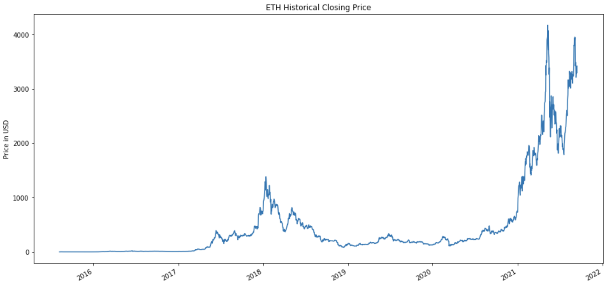
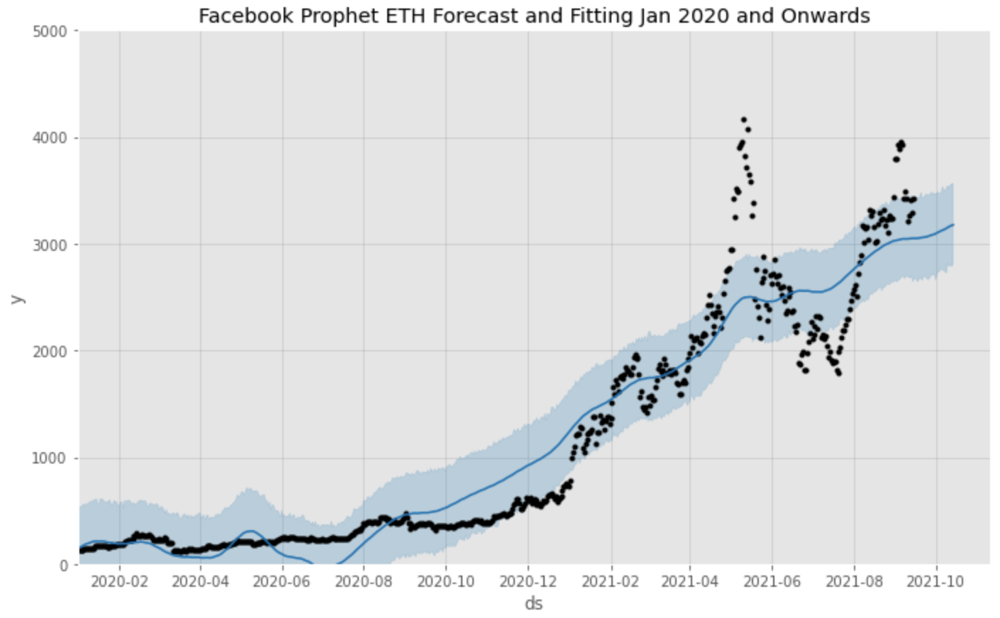

# Ethereum-Price-Predictor-Using-Glassnode-API

Project By: Anthony Conte

## Overview

The aim of this project is to use data from the Glassnode API in an attempt to predict the future price of Ether. Several models were utilized for forecasting including Linear Regression, ARIMA, LSTM, and Facebook Prophet. 

## Business Problem

One of the biggest concerns facing cryptocurrency investors at the moment is that prices are highly volatile due to the large number of factors that can influence them. It is not uncommon to see massive fluctuations within a single day, or in some instances even just a few hours.

Unlike traditional asset classes such as stocks and bonds, the cryptocurrency market is open 24/7. Many cryptocurrencies, such as Ethereum, are built on open-source blockchain networks. These networks allow users visibility into a number of metrics specifically pertaining to cryptocurrencies that could potentially affect prices. Such metrics include the number of unique wallet addresses, hash rate, as well as Spent Output Profit Ratio (SOPR) to name a few.

The primary audience for this project would be individuals who are looking to invest in this emerging asset class. These models could provide utility to investors by allowing them to have a better understanding of which factors influence price to help guide their investment decisions. 

## Data Science Process Steps

* The data was collected using the Glassnode API, then examined for Stationarity, Trend, and Seasonality prior to the modeling process.
* To establish a baseline, a linear regression model was used.
* Several other models such as ARIMA, LSTM, and Facebook Prophet were used with varying results. 

## Results
*ARIMA*

*LSTM*

*FB Prophet*

